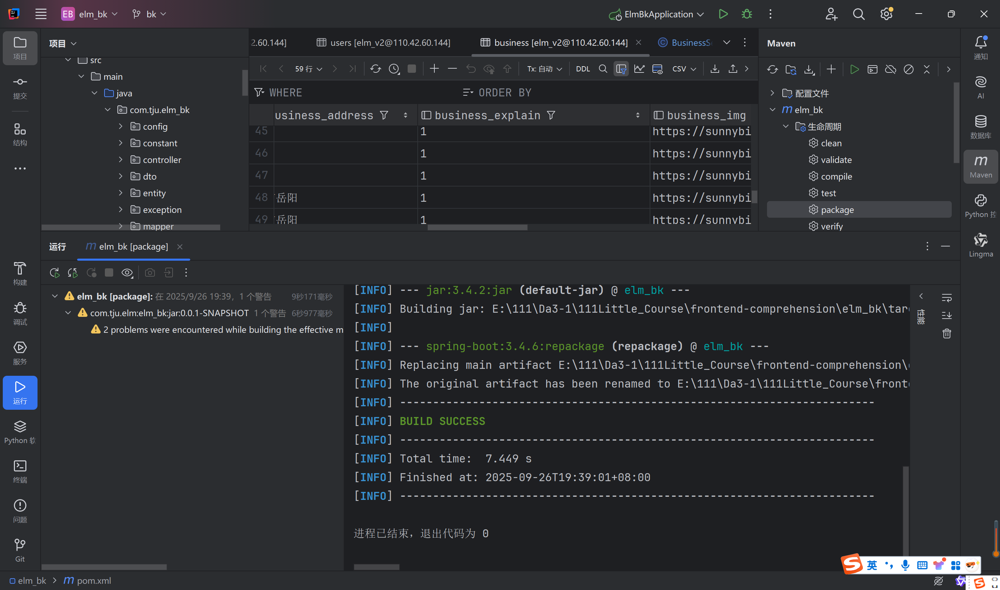
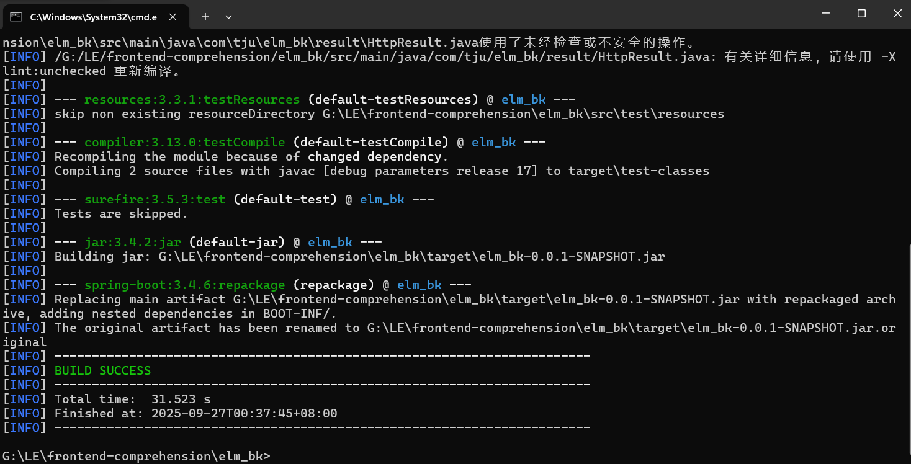
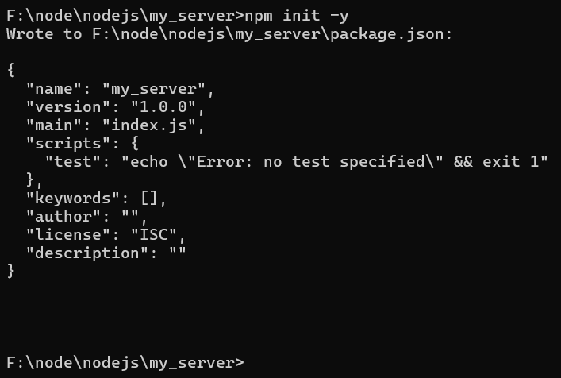

# 饿了吧微服务版

原有“饿了吧”项目单体结构微服务化，是原仓库针对“架构驱动的软件开发实践”的分支，主仓库位于 [https://gitee.com/dai-mingjing/frontend-comprehension.git](https://gitee.com/dai-mingjing/frontend-comprehension.git)

---

# 微服务化后的说明

## 1 目录说明

- `/cloud` 几乎可以直接用于云部署的配置文件和镜像包，具体说明见下面的部署

- `/elm_bk` 原单体项目后端

- `/elm_cloud` 微服务后的后端，每个服务是一个模块，还存在公共模块

- `/elmclient` 适用于微服务项目的前端，适用于单体的前端请看原仓库

- `/documents`一些文档，还有一些更为详细的说明在 `description.md`，带*标记的内容只是特定时期的记录

## 2 技术栈

**新添技术栈**

- spring cloud

- gateway

- nacos

- openfeign

- sentinel

- 服务治理一系列

**使用的服务/中间件**

- redis

- mysql

- rabbitmq

- nacos

- sentinel

- jagger (忘记怎么拼了。。)

- nginx

- 。。。

## 3 部署指南

**主要描述后端不一样的地方，其他细节参照单体时的部署**

所有配置文件存放在`/cloud/application/`下，其中`/common`下的文件用于不带nacos配置管理的镜像使用，`/shared`下的文件用于带配置管理的镜像使用(镜像tar包名带2)；`/nacos`下的配置文件为nacos配置中心的文件

所有镜像存放在`/cloud/images/`下，目录名意义同配置文件目录

每个服务模块目录下的Dockerfile为带配置管理的镜像构建配置，Dockerfile-com为不带配置管理的

**步骤**

定义各个服务的前缀为order、food等，路由为gateway

1.上传镜像至服务器 (带/不带配置管理)

若自己构建镜像，则cd的对应服务模块的目录下，一般不带配置管理的镜像版本是1.0.0，带配置管理的镜像版本是2.0.0 (当然看你构建的实际情况)

```bash
# 构建镜像
docker build -t elm-micro-<服务前缀> .
# 打包镜像
docker save elm-micro-<服务前缀> -o elm-micro-<服务前缀>.tar
```

2.加载镜像

```bash
docker load -i <镜像包tar在服务器上的路径>
```

3.创建并运行容器

- 一般创建一个专门存放这个项目的目录`/elm-micro`

- 在这个目录下创建各个服务专属目录如 `/order-service`等，路由为`/gateway`

- 在对应目录上传配置文件以及jar包，带配置管理的需要上传相应的`application.yml`以及`bootstrap`，如果是直接使用的`/cloud/application`中的文件需要去掉文件名的服务前缀；然后jar包需要改名为 `elm-<服务前缀>-app.jar`

- 然后对于配置文件中会有一些参数`client-ip`需要改成所部署的服务器ip

- 创建并运行容器
  
  如notification-service，容器名一般为 `elm-<服务前缀>-app`，注意有些服务的配置(可看配置文件)如果存在sentinel等服务治理相关的可能需要映射更多的端口，还是注意要与配置文件一致
  
  ```bash
  # 带配置管理
  docker run -d --name elm-notification-app \
  -p 8884:8884 
  -v (pwd)/elm-notification-app.jar:/elm-notification-app.jar 
  -v (pwd)/application.yml:/application.yml 
  -v $(pwd)/bootstrap.yml:/bootstrap.yml 
  elm-micro-notification:2.0.0
  # 不带配置管理
  docker run -d --name elm-notification-app \
  -p 8884:8884 
  -v (pwd)/elm-notification-app.jar:/elm-notification-app.jar 
  -v (pwd)/application.yml:/application.yml 
  elm-micro-notification:1.0.0
  ```

还有一些命令，详细的自己查：

```bash
# 重启服务
docker restart <容器名>
# 查看容器日志
docker logs -f <容器名> --tail 200
```

## 4 一些说明

### 4.1 提供一些已部署服务信息

**一些可访问路径 (路径后跟的是必要的账户密码)**

项目访问：[http://REDACTED_DOMAIN/](http://REDACTED_DOMAIN/)

nacos：[http://bobchasm:8848/nacos]([http://bobchasm:8848/nacos](http://bobchasm:8848/nacos)) nacos 123456

rabbit：[http://REDACTED_DOMAIN:15672]([http://REDACTED_DOMAIN:15672](http://REDACTED_DOMAIN:15672)) rabbit rabbit

接口文档：域名+各个服务的端口 (配置文件中有写)

**一些测试账户可以直接登录**

普通用户：

- username: bob_user
- password: Bobuser123

商家用户：

- username: bob_business
- password: Bobbusiness123

管理员：

- username: bob_admin
- password: Bobadmin123

### 4.2 联系方式

如有问题或建议，请通过以下方式联系：

- **邮箱**：<br>
  zengyicydd@tju.edu.cn <br>
  daimingjing142857@tju.edu.cn <br>

---

# 原单体架构说明

## 1 项目结构

后端代码存放目录  `/elm_bk`

## 2 项目部署

**目前单体项目部署路径**

- 如果想直接查看效果请访问：[http://REDACTED_DOMAIN:8081/](http://REDACTED_DOMAIN:8081/)
  
  特别提供一个项目管理员账号：用户名 admin，密码 Admin123

- 后端部分接口前缀：[http://REDACTED_DOMAIN:8080](http://REDACTED_DOMAIN:8080)

- 接口文档路径：[http://REDACTED_DOMAIN:8080/swagger-ui/index.html](http://REDACTED_DOMAIN:8080/swagger-ui/index.html)

**若自己部署请注意：**

1. 如需验收整个项目(即前后端完整效果)，请使用我们提供的sql建库并在配置文件中使用它，以下会详细说明

2. 以下部署说明主要针对win系统，Linux系统部署方法命令行操作类似
   
   可参考 [从0开始在linux服务器上部署SpringBoot和Vue_vue项目linux部署-CSDN博客](https://blog.csdn.net/m0_53140426/article/details/144745031?ops_request_misc=%257B%2522request%255Fid%2522%253A%2522061248a22aceb1ff2288a8b50a813a59%2522%252C%2522scm%2522%253A%252220140713.130102334.pc%255Fall.%2522%257D&request_id=061248a22aceb1ff2288a8b50a813a59&biz_id=0&utm_medium=distribute.pc_search_result.none-task-blog-2~all~first_rank_ecpm_v1~rank_v31_ecpm-2-144745031-null-null.142^v102^pc_search_result_base7&utm_term=Linux%E9%83%A8%E7%BD%B2spingboot%E5%92%8Cvue&spm=1018.2226.3001.4187)

3. 本项目在版本 `4eeb319c5eb4eccae252fffdf04004a9eb6daf05 (积分系统开始)` 后使用了redis、rabbitmq，当前设置均为服务器的配置信息，如需使用自己本地的中间件，请在本地启动相关服务并修改配置文件

#### 2.1 后端部分

**技术栈**

- SpringBoot

- Maven

- Mybatis

- redis

- rabbitmq

##### 开发环境

JDK 17

SpringBoot 3.4.6

Mybatis 3.0.4

MySQL版本信息：

```
 Source Server         : localhost
 Source Server Type    : MySQL
 Source Server Version : 80040 (8.0.40)
 Source Host           : localhost:3306
 Source Schema         : elm_v2

 Target Server Type    : MySQL
 Target Server Version : 80040 (8.0.40)
 File Encoding         : 65001
```

##### 配置

- 配后端置文件
  
  ```
  /elm_bk/src/main/resources/application.yml
  ```
  
  可修改配置：数据库、redis、rabbitmq，若您想尝试使用这些本地服务

- 数据库
  
  使用本地数据库服务时，请新建一个名为 **elm_v2** 的数据库，并运行以下路径中的建表语句：
  
  ```
  /elm_bk/sql/elm_v2.sql
  ```

##### 部署运行

1.中间件服务准备

如果您想使用自己的中间件(已经修改相关配置文件的情况下)，请先启动自己的服务，否则忽略这一步

2.打包

若使用IDEA打包项目，先 clean，再 package，成功控制台如图

若使用命令行打包：

在 /elm_bk 中打开cmd，执行：

```bash
mvn clean package
```

成功如下图：



生成的项目jar包路径在:

```
/elm_bk/target/elm_bk-0.0.1-SNAPSHOT.jar
```

3.命令行在jar包存放的目录中执行:

```bash
java -jar elm_bk-0.0.1-SNAPSHOT.jar
```

如果出现报错 "error='页面文件太小，无法完成操作。' (DOS error/errno=1455)" 请重新执行以下命令:

```bash
java -Xmx128m -Xms64m -XX:MaxMetaspaceSize=64m -XX:+UseSerialGC -jar elm_bk-0.0.1-SNAPSHOT.jar
```

注：该命令进行了内存配置

后端配置端口为 8080，请注意端口占用

4.当终端出现以下界面，则启动成功：


如使用IDEA在启动或打包项目时遇到控制台报错如 "找不到符号"，请确保以下位置选择正确


### 2.2 前端部分

基于 Vue3

##### 环境准备

- 保证npm可用
  
  可参见 [VUE安装及环境配置（完整版）-CSDN博客](https://blog.csdn.net/qq_52611686/article/details/142653081?ops_request_misc=%257B%2522request%255Fid%2522%253A%2522b9220596f6cbffa1a2f0eb8c533005ed%2522%252C%2522scm%2522%253A%252220140713.130102334..%2522%257D&request_id=b9220596f6cbffa1a2f0eb8c533005ed&biz_id=0&utm_medium=distribute.pc_search_result.none-task-blog-2~all~top_positive~default-1-142653081-null-null.142^v102^pc_search_result_base7&utm_term=vue%E5%AE%89%E8%A3%85%E5%8F%8A%E7%8E%AF%E5%A2%83%E9%85%8D%E7%BD%AE&spm=1018.2226.3001.4187)

- node
  
  可参见 [Node.js安装与配置（详细步骤）_nodejs安装及环境配置-CSDN博客](https://blog.csdn.net/qq_42006801/article/details/124830995?ops_request_misc=%257B%2522request%255Fid%2522%253A%2522363c66d0a867fcac896383171b678743%2522%252C%2522scm%2522%253A%252220140713.130102334..%2522%257D&request_id=363c66d0a867fcac896383171b678743&biz_id=0&utm_medium=distribute.pc_search_result.none-task-blog-2~all~top_positive~default-1-124830995-null-null.142^v102^pc_search_result_base7&utm_term=%E9%85%8D%E7%BD%AEnode&spm=1018.2226.3001.4187)

##### 运行

- 如在ide里直接启动
  
  1.可以使用 Visual Studio Code 打开项目前端部分:
  
  ```
  /elmclient
  ```
  
  2.在其终端 TERMINAL 安装依赖 (请先确保具有vue环境与npm):
  
  ```bash
  npm -i
  ```
  
  如果失败，则尝试:
  
  ```bash
  cnpm -i
  ```
  
  3.启动
  
  ```bash
  npm run serve
  ```
  
  当终端出现访问url，则启动成功。访问url即可跳转至项目首页(在此之前请保证后端项目已启动)

- 如要进行部署(已配置node)
  
  以下内容参考 [Vue前端项目部署的三种方案_vue项目部署-CSDN博客](https://blog.csdn.net/qq_44741577/article/details/139236697?ops_request_misc=%257B%2522request%255Fid%2522%253A%252201c3d7a19a919480657fd6784f177099%2522%252C%2522scm%2522%253A%252220140713.130102334..%2522%257D&request_id=01c3d7a19a919480657fd6784f177099&biz_id=0&utm_medium=distribute.pc_search_result.none-task-blog-2~all~sobaiduend~default-1-139236697-null-null.142^v102^pc_search_result_base7&utm_term=%E5%89%8D%E7%AB%AFvue%E9%A1%B9%E7%9B%AE%E9%83%A8%E7%BD%B2&spm=1018.2226.3001.4187)
  
  注：由于前端请求接口时使用本地路径前缀，请将前后端部署在同一台计算机上，保证可以localhost本地访问，否则需要修改所有前端代码接口请求路径localhost为指定域名或ip，以及前端AdminHome.vue、MerchantOrders.vue、MyInformation.vue、Notifications.vue、OrderList.vue中的WebSocket请求路径（目前是{wsProtocol}//localhost:8080/ws/{sid}）
  
  1.在 **/node/nodejs/** 下新建一个名为 **my_server** 的文件夹，在此文件夹下打开cmd命令行终端 (注：最好使用管理员身份打开)
  
  2.执行：
  
  ```bash
  npm init -y
  ```
  
  出现以下输出则成功：
  
  
  
  3.安装快速部署插件 **express**
  
  ```bash
  npm i express
  ```
  
  4.在前面创建的 **my_server** 目录下新建文件 server.js，内容如下:
  
  ```js
  // 引入express
  const express = require("express");
  // 配置端口号
  const PORT = 8081;
  // 创建一个app服务实例
  const app = express();
  // 配置静态资源
  app.use(express.static(__dirname + "/public"));
  
  // 绑定端口监听
  app.listen(PORT, () => {
    console.log(`本地服务器启动成功，http://localhost:${PORT}`);
  });
  ```
  
  5.在 **my_server** 文件夹下新建文件夹 **public**，后续用于存放vue项目的文件
  
  6.打包前端代码
  
  - 直接将以下路径目录中的所有东西复制到前面创建的 **my_server** 文件夹下的 **public** 中。若之后在下面第7点出现失败，请尝试自己打包(如下一点)
    
    ```
    /elmclient/dist/
    ```
  
  - 自己打包：
    
    使用ide (Visual Studio Code) 或者是命令行终端打开项目的前端部分:
    
    ```
    /elmclient
    ```
    
    执行:
    
    ```bash
    npm i    #如失败则尝试 cnpm i
    npm run build
    ```
    
    项目文件 **elmclient** 下中将出现文件夹 **dist**，之后同上
  
  7.在 **my_server** 目录下打开cmd，执行:
  
  ```bash
  node .\server.js
  ```
  
  出现以下输出则启动成功，可以通过输出的url访问到app的首页
  
  ```
  本地服务器启动成功，http://localhost:8081
  ```
